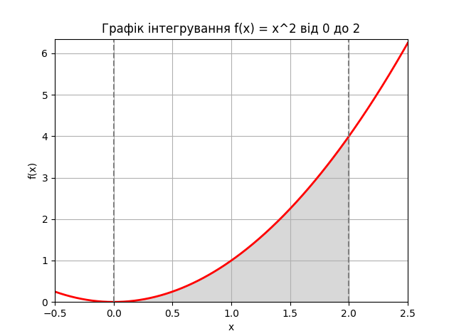

# Завдання: Обчислення визначеного інтегралу за допомогою методу Монте-Карло та функції `quad`

## Опис завдання
Метою цього завдання було обчислення визначеного інтегралу функції f(x) = x² на інтервалі від 0 до 2 за допомогою двох методів:
1. **Метод Монте-Карло**.
2. **Метод чисельного інтегрування функції `quad` з бібліотеки `SciPy`**.

Після обчислення інтегралу за допомогою обох методів ми порівняли результати для оцінки точності методу Монте-Карло.

## Результати
1. **Інтеграл методом Монте-Карло**: 2.668
2. **Інтеграл за допомогою `quad`**: 2.666666666666667 (з похибкою: 2.96e-14)

## Візуалізація
Графік функції f(x) = x² та область під кривою, яка відповідає обчислюваному інтегралу, було побудовано для наочного представлення результатів.

## Висновки
1. **Точність методу Монте-Карло**:
   - Метод Монте-Карло дав значення інтегралу **2.668**, що є близьким до точного значення інтегралу **2.66667**, обчисленого за допомогою функції `quad`.
   - Незначне відхилення (0.00134) пов'язане з випадковим характером методу Монте-Карло і може бути зменшене за рахунок збільшення кількості точок для симуляції.

2. **Точність методу `quad`**:
   - Метод `quad` забезпечує дуже високу точність (похибка ~2.96e-14), оскільки він є чисельним методом на основі адаптивної квадратурної формули Гаусса і працює набагато точніше для таких завдань.

3. **Використання методу Монте-Карло**:
   - Метод Монте-Карло є хорошим інструментом для наближених обчислень, коли точний аналітичний метод може бути складним для застосування або обчислювально витратним.
   - Проте він є менш точним у порівнянні з чисельними методами, такими як `quad`, особливо для простих функцій, де аналітичний метод може надати майже точний результат.

4. **Рекомендації**:
   - Для задач, які потребують високої точності, доцільно використовувати методи чисельного інтегрування, такі як `quad`.
   - Метод Монте-Карло підходить для наближених обчислень у складніших випадках або для функцій вищих вимірів.

## Заключення
Метод Монте-Карло є ефективним для оцінки інтегралів, особливо в складних випадках, але для простих функцій, таких як f(x) = x², чисельні методи на основі квадратурних формул, як-от `quad`, надають точніші результати.
